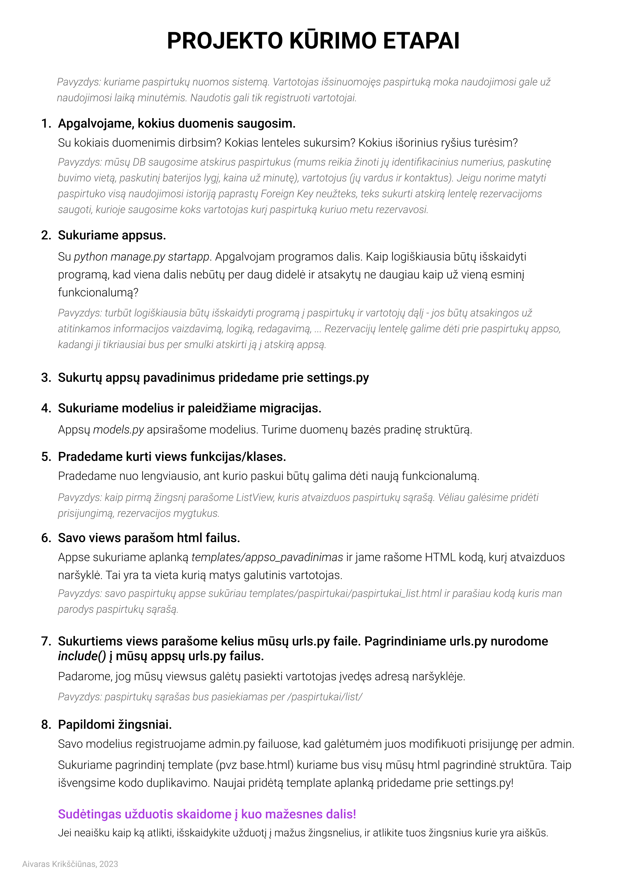

# Baigiamojo darbo pradžia 

Kadangi baigiamasis darbas turi būti jūsų įgytų žinių ir gebėjimų demonstravimas, ši instrukcija specialiai bus mažai detali.

## Projekto pradžia

### Git repozitorijos sukūrimas

Jei dar neturim git repozitorijos savo projektui, reikia ją susikurti vienu iš mūsų išmoktų būdų.
[Git pagrindai](https://github.com/DonatasNoreika/python1lygis/wiki/Versij%C5%B3-valdymo-sistemos-(GIT))

## Django projekto sukūrimas

Sukuriam Django projektą:
https://github.com/robotautas/kursas/blob/master/Django/MDs1/django1.md

Taip pat susikuriam vieną ar daugiau programėlių (apps).


## Modeliai

Dirbant su Django, geriausia pradėti nuo modelių, kurie aprašo mūsų nuodojamus duomenis ir taip duoda mūsų projektui "griaučius".

### Modelių pavyzdys pagal Įrankių nuomos projekto aprašymą:

[Įrankių nuomos projektas](https://github.com/karina-klinkeviciute/irankiu_nuoma)

Sukuriam appsą "Įrankis"

Jame atsiras "models.py" failas

Šiame faile mums reikia kurti savo modelius. Pateiksiu pavyzdį, kaip pagal turimą aprašymą sukurti modelį:

Aprašymas:

- įrankis
    - pavadinimas
    - aprašymas
    - nuotrauka
    - naudotojas
    - kategorija 
    - galia
    - ar su pristatymu, ar reikia pasiimt


Modelis:

```python
class Irankis(models.Model):
    pavadinimas = models.CharField(max_length=255)
    aprasymas = models.TextField(blank=True, null=True)
    galia = models.IntegerField(blank=True, null=True)
    pristatymas = models.BooleanField()
    kategorijos = models.ManyToManyField(Kategorija)
    naudotojas = models.ForeignKey(NaudotojoProfilis, on_delete=models.CASCADE)
    nuotrauka = models.ImageField(upload_to="irankis", null=True, blank=True)
    
``` 
[Modelių kūrimo aprašymas](https://github.com/robotautas/kursas/blob/master/Django/MDs2/django2.md)

## Administravimo aplinka

Po to, kaip susikuriam modelius, užregistruojam juos [administravimo aplinkoje](https://github.com/robotautas/kursas/blob/master/Django/MDs3/django3.md)

Taip pat susikuriam pagrindinį vartotoją (superuser)

Sukonfigūravę admin aplinką, galim pradėti vesti duomenis

## Views, urls ir templates

Kiekvienam duomenų atvaizdavimui (daiktų/dalykų/straipsnių sąrašams, vieno daikto/dalyko atvaizdavimui, turinio suvedimui) reikia šios trijulės - view, url, template. Nėra labai svarbu, kuria tvarka juos kuriam. Kiekvienas atrasit sau patogiausią būdą. 

Nuoroda (url) rašoma į programėlės urls.py failą ir susieją užklausą (kelią), kurią naudotojas įveda naršyklėje, ir view. View, gavęs šia užklausą, pagal ją atrenka, kokius duomenis mums reikia pateikti, "surašo" juos į paruoštą "blanką" - template ir pateikia atgal naudotojui. 

[Daugiau apie templates ir Views](https://github.com/robotautas/kursas/blob/master/Django/MDs4/django4.md)

## Registracija

Ne visuose projektuose bus reikalinga registracija. Bet jei jūsų projekte ji reikalinga, [čia yra apie vartotojų registraciją](https://github.com/robotautas/kursas/blob/master/Django/MDs7/django7.md)

## Autorizuotas turinys

Jei pas jus projekte yra naudotojų registracija, ir jei kai kurį turinį rodot tik registruotiems, ar tik daliai registruotų naudotoj7, [čia galit rasti, kaip tai padaryti](https://github.com/robotautas/kursas/blob/master/Django/MDs8/django8.md)

## Formos

Jei jūsų svetainės naudotojai turi turėti galimybę įvesti turinį - [tam reikia formų](https://github.com/robotautas/kursas/blob/master/Django/MDs8/django8.md)

## Kiti naudingi dalykai

Jei jūsų projekte bus keliami paveikslėliai, naudojamas puslapiavimas ar norėsit naudotojams leisti ieškoti, [apie tai rasit informacijos čia](https://github.com/robotautas/kursas/blob/master/Django/MDs6/django6.md)

Jei norit padaryti, kad jūsų vartotojai galėtų rašyti gražiai suformatuotus tekstus, [galit įdiegti TinyMCE](https://github.com/robotautas/kursas/blob/master/Django/MDs8/django8.md#html-laukai-modeliuose)


## Frontend (HTML, CSS, JS)

[HTML tutorial](https://www.w3schools.com/html/)

[CSS tutorial](https://www.w3schools.com/css/)


## Trumpa Django projekto kūrimo santrauka (cheat sheet)


